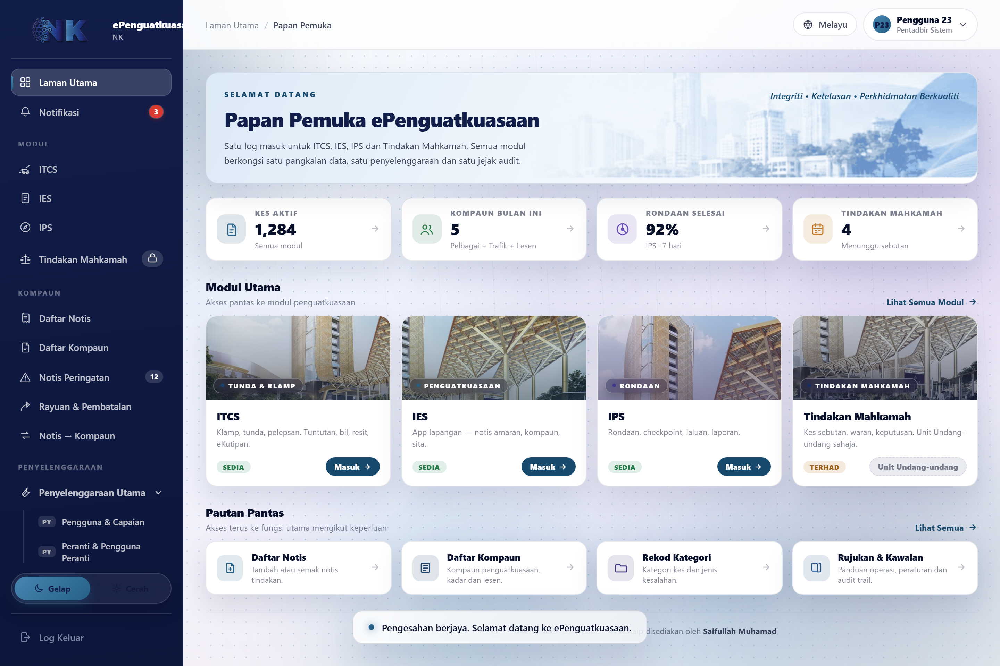
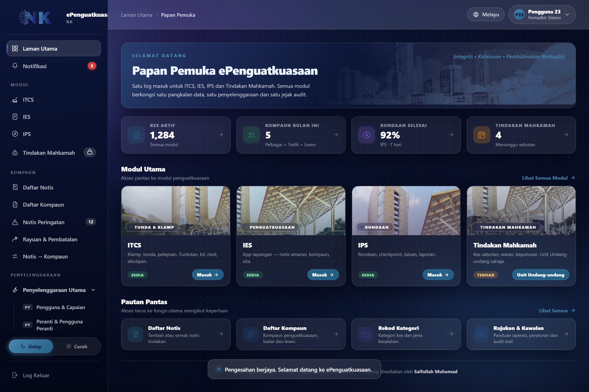
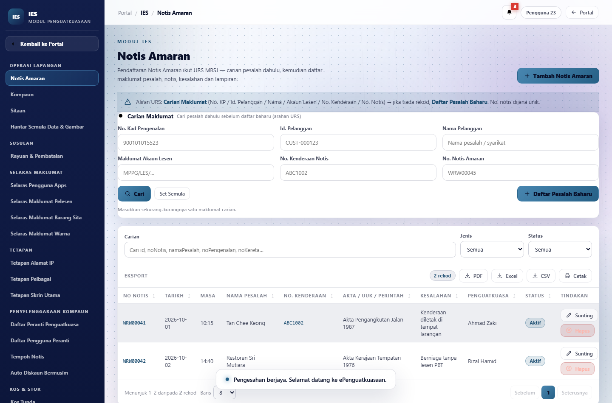
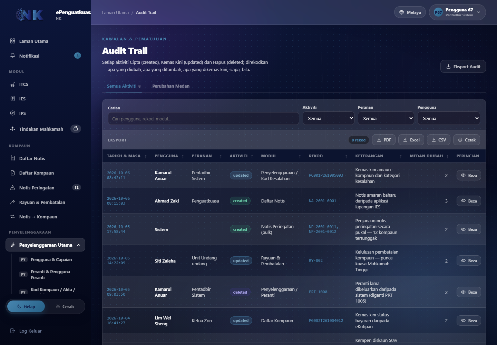
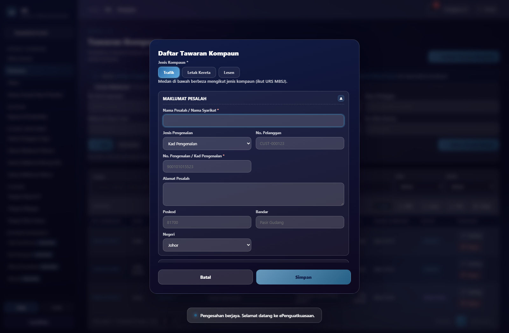
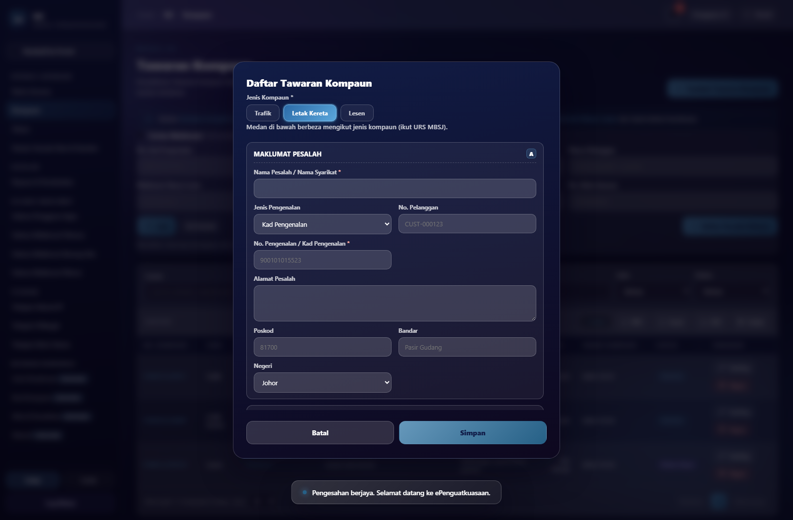
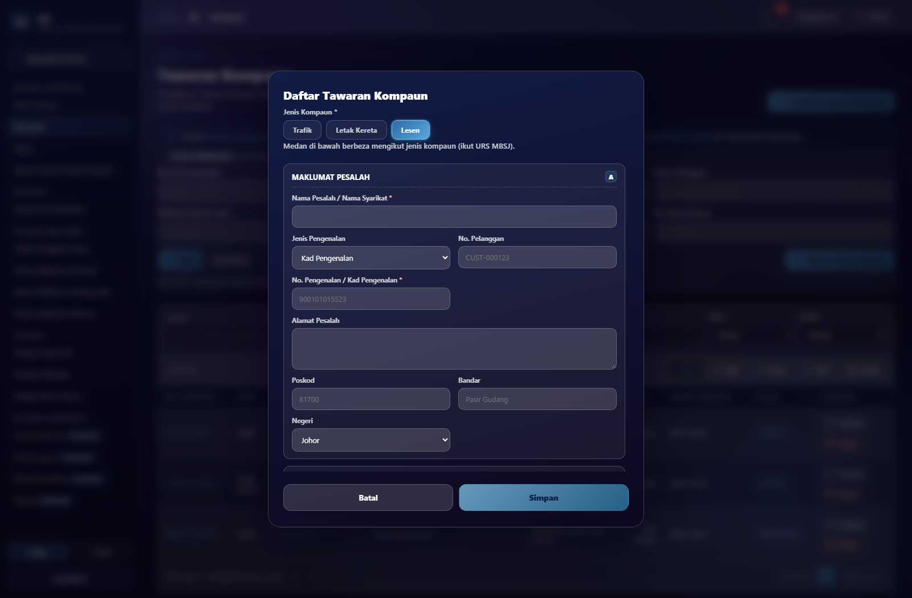

# ePenguatkuasaan — Portal Penguatkuasaan Bersepadu (POC)

Prototaip (POC) **portal berpusat** yang menggabungkan empat modul penguatkuasaan majlis
di bawah satu pintu masuk, satu pangkalan data, satu penyelenggaraan dan satu jejak audit.

> **Nota:** Ini **prototaip** untuk tujuan demonstrasi sahaja — data adalah contoh,
> tiada backend. Dibuka terus dalam pelayar.

## Modul

| Modul | Skop |
|---|---|
| **ITCS** | Clamp / tunda / kompaun. Notis, bil, pelepasan, pembayaran. |
| **IES** | Aplikasi penguatkuasaan lapangan — notis amaran, kompaun, sitaan. |
| **IPS** | Integrated Patrolling System — rondaan, checkpoint, pelaporan. |
| **Tindakan Mahkamah** | Pengendalian kes dan aliran pendakwaan. |

## Ciri utama

- **Satu fail HTML** — boleh buka offline, tiada pemasangan.
- **Skrin penuh per modul** — setiap kad modul membuka shell modul sendiri (sidebar,
  bar atas, menu penuh) meniru sistem asal.
- **Menu bersection** — Operasi / Bil & Kutipan / Kenderaan / Pelupusan / Tetapan.
- **CRUD penuh** — satu enjin generik untuk semua entiti, setiap borang ikut medan URS.
- **Jadual standard** — carian, penapis, sorting, sticky header, pagination,
  corak zebra, eksport **PDF / Excel (.xlsx sebenar) / CSV / Cetak**.
- **Kompaun ikut jenis** — Pelbagai / Trafik / Lesen dengan medan **berbeza** setiap jenis.
- **Tema gelap & cerah** — boleh ditogol dalam setiap modul.
- **Audit trail** — satu rekod per medan yang diubah (nilai lama → baharu).
- **Autofill log masuk** untuk demo pantas.

## Cara lihat

1. Muat turun `index.html` dan buka dalam pelayar (Chrome/Edge/Firefox).
2. Log masuk dengan butiran demo:
   - **No. Kad Pengenalan:** `900101-14-5567` (sudah diisi)
   - **Kata laluan:** `P@ssw0rd` — **taip manual** (autofill kata laluan hanya ada
     pada salinan local untuk demo pantas; versi awam sengaja tiada).

## Screenshot

| Papan Pemuka (cerah) | Papan Pemuka (gelap) |
|---|---|
|  |  |

| Modul IES | Audit Trail |
|---|---|
|  |  |

| Borang Trafik | Borang Letak Kereta | Borang Lesen |
|---|---|---|
|  |  |  |

## Struktur

```
index.html      # prototaip penuh (satu fail, data tertanam)
screenshots/    # tangkapan skrin
```

## Status

Fasa POC. Modul dan medan borang dirujuk daripada dokumen URS MBSJ/MBPG.
Beberapa bahagian (autofill API kenderaan, struktur menu URS penuh) masih dalam kerja.

---

Prototaip disediakan oleh **Saifullah Muhamad**.
